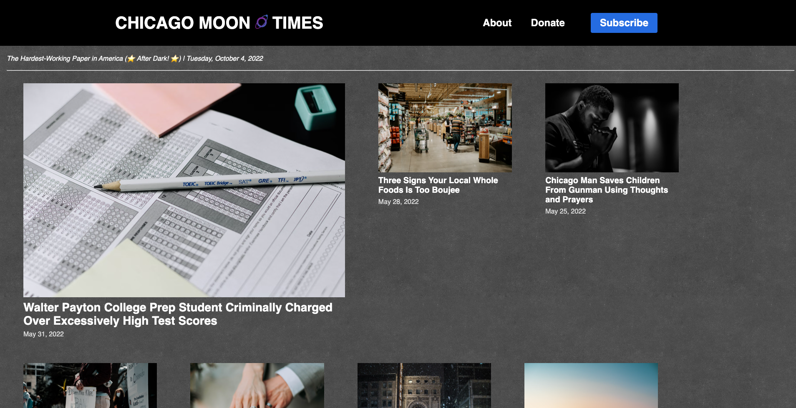
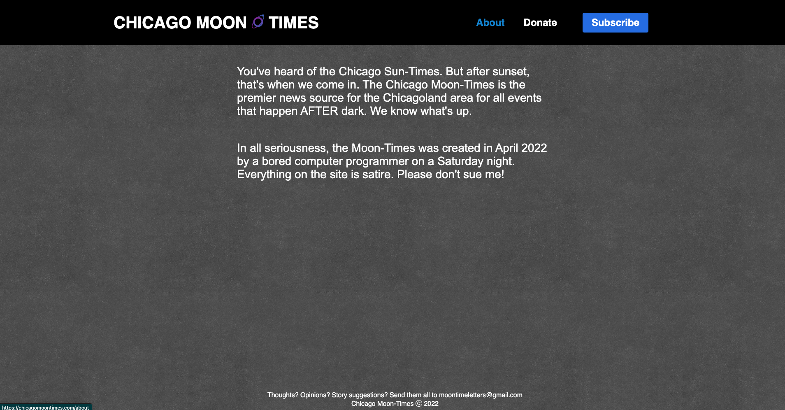
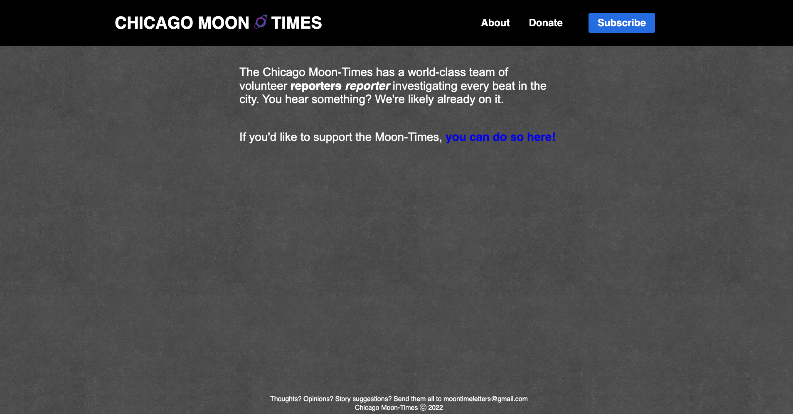
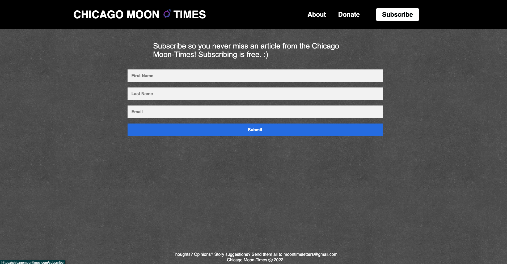

# chicagomoontimes.com

You've heard of the Chicago Sun-Times. But after sunset, that's when we come in. The Chicago Moon-Times is the premier news source for the Chicagoland area for all events that happen AFTER dark. We know what's up.

In all seriousness, this is a satirical news organization I made one Saturday night in April 2022 when I was bored.

This repository stores the code for the website [chicagomoontimes.com](https://chicagomoontimes.com/). This site was built using React.js and the code is free to reuse!

## Update 10/04/2022

I'm shutting down the website but will keep the following images for records.

